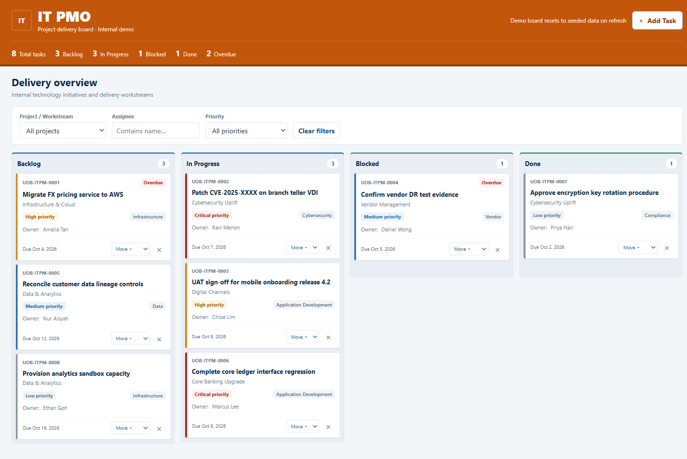
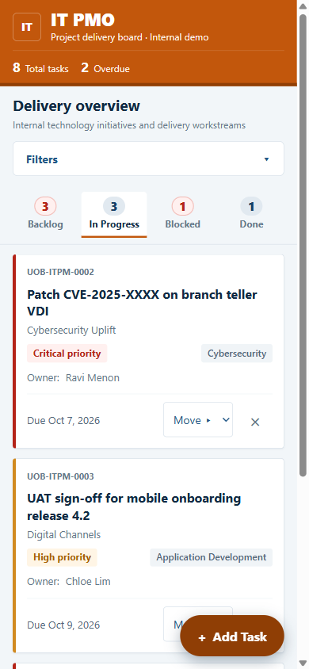

# IT PMO | Project Delivery Board

A Kanban-style task board for tracking IT delivery work, built as an exercise for the "Agentic AI Applications with Claude Code" training.

**Live demo:** https://vinodrawat2001-max.github.io/UOB-Claude-Training/

On phones the board shows one status at a time, chosen from a sticky tab bar. Filters collapse behind a toggle, and Add Task floats at the bottom of the screen.

## Features

- Four columns: Backlog, In Progress, Blocked, Done, with a summary strip of task counts and overdue items
- Filter by project/workstream, assignee and priority
- Add tasks through a validated form
- Move tasks with drag and drop or the Move menu on each card
- Delete tasks
- Mobile layout: status tabs with overdue highlighting, a bottom-sheet task form and 44px touch targets
- Accessible markup: live-region toasts, visible focus outlines and a native `<dialog>` for task entry

## Run it

There is no build step. Open `index.html` in a browser.

Demo data is generated on load with dates relative to today, and nothing is saved, so the board resets on every refresh.

## Tech and structure

- `index.html`: the whole app, with inline CSS and vanilla JavaScript and no dependencies
- `.github/workflows/pages.yml`: checks `index.html` on every push and pull request to `main`, then deploys it to GitHub Pages on push
- `CLAUDE.md`: architecture notes for Claude Code
- `.claude/`: the `/push-to-github` command and project skills (`frontend-design`, `sleek-design-mobile-apps`, `vercel-composition-patterns`)
- `.mcp.json`: Playwright MCP server used to capture screenshots
- `docs/`: screenshots used in this README, captured with the Playwright MCP server

New-task notifications are sent through FormSubmit. The endpoint in `index.html` is a placeholder (`YOUR_EMAIL@example.com`), so replace it with your own address to enable them.
